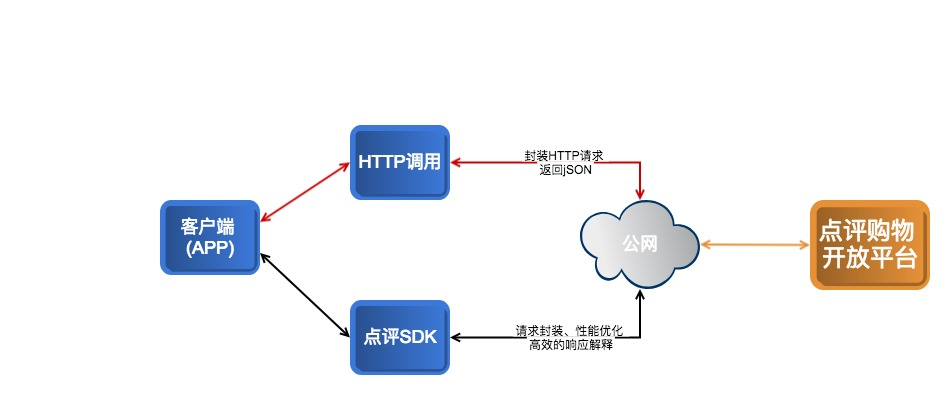

.. API

API
=========================

点评购物开放平台（DIANPING Open Platform）的API是基于HTTP协议来调用的，开发者（ISV）可以直接使用点评提供的官方SDK（支持多种语言，包含了封装的请求，签名加密，响应解释，性能优化等）来调用，也可以根据开放平台的协议来封装HTTP请求进行调用，以下主要针对自行封装HTTP请求进行API调用的原理进行详细解说。

调用流程
--------------------------------

根据点评购物开放平台的协议：填充参数 > 生成签名 > 拼装HTTP请求 > 发起HTTP请求 > 得到HTTP响应 > 解释JSON/XML结果，以下是大体的调用过程示意图：

调用入口
--------------------------------

调用API的服务URL地址，开放平台目前提供了2个环境给ISV使用：沙箱环境，正式环境。

 + **沙箱环境**：ISV上线之前的模拟环境，client_id申请成功后即可使用，支持所有的API调用，权限和流量均无限制，可放开使用。
 + **正式环境**：ISV上线后的正式环境，此环境的入口与沙箱环境完全一致，只不过应用上线后，流量控制会打开，具体的流量控制与client_id相关，具体可以咨询。

+----------+-----------------------------------+
| 调用环境 | 服务器地址(HTTP)                  |
+==========+===================================+
| 沙箱环境 | https://openshopping.51ping.com   |
+----------+-----------------------------------+
| 正式环境 | https://openshopping.dianping.com |
+----------+-----------------------------------+

公共参数
--------------------------------

调用任何一个API都必须传入的参数，目前支持的公共参数有：

签名算法
--------------------------------

为了防止API调用过程中被黑客恶意篡改，调用任何一个API都需要携带签名，开放平台服务端会根据请求参数，对签名进行验证，签名不合法的请求将会被拒绝。开放平台目前支持的算法是MD5加密，签名大体过程如下：

 + 对所有API请求参数（包括公共参数和业务参数，但除去sigin参数和byte[]类型的参数），根据参数名称的ASCII码表的顺序排序。如：foo=1，bar=2，foo_bar=3，foobar=4排序后的顺序是bar=2,foo=1,foo_bar=3,foobar=4。
 + 将排序好的参数和参数值拼装在一起，根据上面的示例得到的结果为：bar2foo1foo_bar3foobar4。
 + 把拼装好的字符串采用utf-8编码，使用签名算法对编码后的字节流进行摘要。在拼装的字符串前面加上client_secret后，再进行摘要，如md5(secret+bar2foo1foo_bar3foobar4).
 
调用示例
--------------------------------

以优惠券核销为例：

1. 设置参数值
  公共参数：
   | method = 
   | client_id = 
   | timestamp = 
   | version = 1.0
   
2. 业务参数
  业务参数

API文档
--------------------------------

.. _coupon
.. include:: api/coupon/coupon.rst

订单退货
::::::::::::::::::::::::::::::::::::

订单退货ddd

订单换货
::::::::::::::::::::::::::::::::::::

订单退货ddd

订单核销退货统一接口
::::::::::::::::::::::::::::::::::::

订单核销退货统一接口dddd
